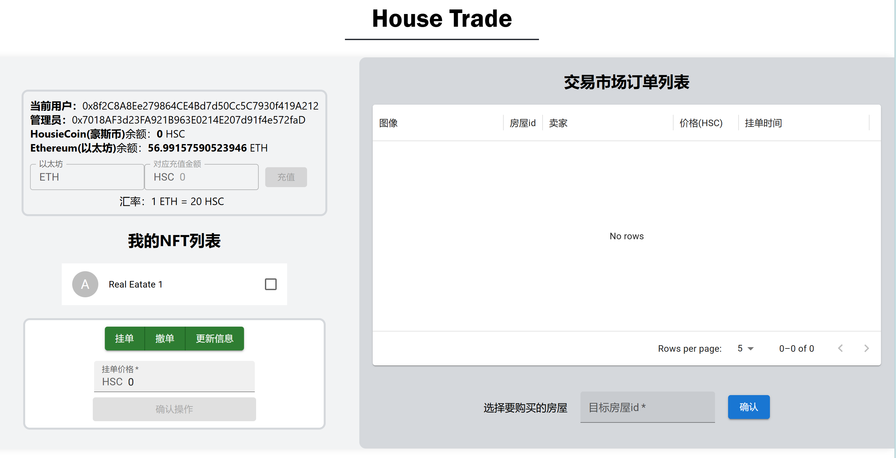
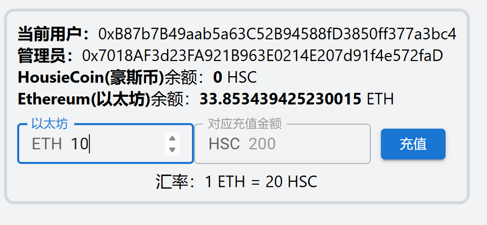
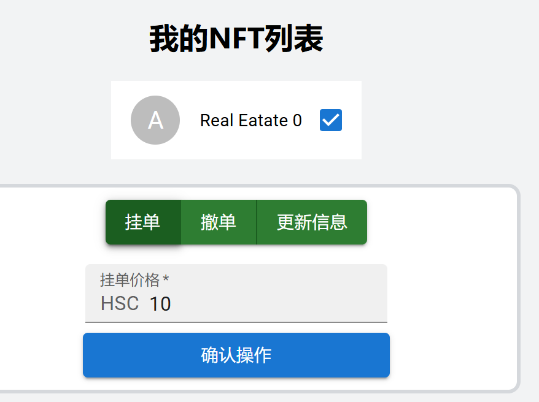
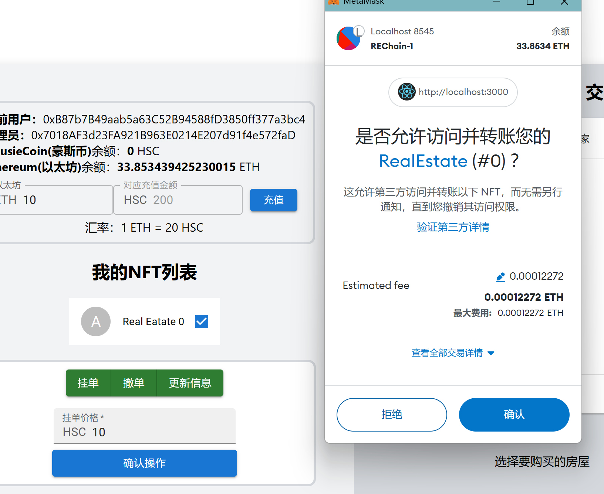
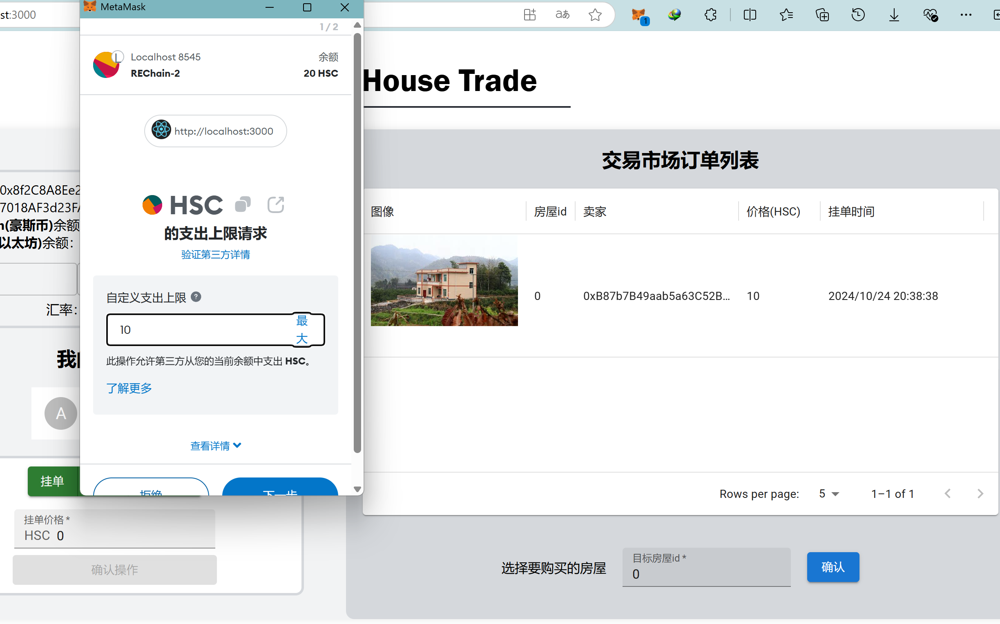

# Real-Estate-Market : HousieGo

> 24秋blockchain课程项目
> From **lechatelierlenz**

## 项目主要介绍

- 本项目是一个去中心化的房屋（NFT）交易系统的简单实现，主要包含了以下功能：
  - 用户可以查看自己拥有的房产列表。并可以挂单出售自己的房屋(挂单包含价格等信息),还提供撤单，更新出售价格等操作。
  - 用户查看所有出售中的房产，并査询一栋房产的主人，及各种挂单信息。
  - 用户选择能够利用测试以太币充值本平台代币（HSC:HousieCoin）来支付，购买某个其他用户出售的房产。
    - 在购买中，平台会向卖家收取一定**手续费** :
    在一个房产出售完成时，用户支付的部分平台代币HSC(=某栋房产在平台上的挂单时长(timestamp)\*固定比例\*房产价格)被转入给合约部署者。

## 如何运行

1. 合约部署
    - 首先需要启动ganache网络并在`harhat.config.ts`文件夹下做好配置
      - 合约部署时默认会给除了第一个账户以外的4个账户分配房产（NFT）,所以需要确保ganache网络中至少有5个账户
    - 在根目录下执行`npm install`，确保依赖内容完整正确
    - 进入`\contracts\`文件夹，执行`npx hardhat compile`
    - 终端打开根目录执行`./deploy.ps1` [Windows系统]
      - 若部署失败或需要重新部署也只需重复执行该脚本
      - 若为其它系统，执行`npx hardhat ignition deploy .\ignition\modules\RESwap.ts --network ganache`

2. 前端启动
    - 将`\ignition\deployments\chain-1337\deployed_addresses.json`中的合约地址更新到`house-change\src\utils\contract-addresses.json`中
    - 将`\artifacts\contracts\`下各个文件夹中的`.json`移动到上面的`...\uils\abis`文件夹下
    - 终端打开`\house-change`，先运行`npm install`，再运行`npm start`，随后前端就启动了

## 功能实现分析

### 合约部分

    - 合约主要结构
      - HousieCoin.sol实现ERC20代币合约
      - RealEstate.sol实现ERC721的房屋NFT合约
      - RESwap.sol实现了基于ERC20代币支付的房屋NFT交易合约
    - 部署脚本：ignition\modules\RESwap.ts 

- `HousieCoin.sol`：ERC20代币实现合约,除了基于ERC20标准的基础功能以外，还提供了以太币充值的操作
  
  ```solidity

  contract HousieCoin is ERC20, Ownable {
    /// 构建一个新的HousieCoin合约
    /// 具体的兑换率(1 ETH = rate HSC)
    uint256 public rate;

    constructor(uint256 _rate) ERC20("HousieCoin", "HSC") Ownable(msg.sender) {
        // 初始步骤：为合约的所有者铸造1000个HousieCoin
        // 定义，mint中的amount是以wei为单位的，因此需要乘以10^18
        rate = _rate;
        _mint(msg.sender, 1000 * 10 ** 18);
    }
    // 为指定地址铸造HousieCoin
    function mint(address to,  uint256 amount) public onlyOwner {
        // ps: Ownable合约提供的onlyOwner修饰符确保只有合约的所有者才能调用此函数
        _mint(to, amount);
    }
    // 提供ETH充值获取HousieCoin方法
    receive() external payable {
        // value是msg对象的一个属性，表示发送者发送的以太币数量，单位是wei,因此需要转换为ether
        uint256 tokenAmount = msg.value * rate;
        // balanceOf方法是ERC20合约中的一个方法，用于查询指定地址的代币余额,单位是wei
        // 发送代币给发送者
        _mint(msg.sender, tokenAmount);
    }
    ...
  } 
  ```

  - 实际上还实现了调整汇率的方法，但是前端并没有特意实现该功能  

- `RealEstate.sol`:继承了ERC721实现NFT合约，能够实现房产的NFT化，包含铸造、转移、销毁等功能。同时在此基础上为了方便用户查看自己拥有的房产，重写了`_update`方法，附带更新_ownedTokens,将旧的所有者的token列表中的tokenId删除，将新的所有者的token列表中添加tokenId
  - 为了方便用户查看自己拥有的房产，实现了`tokensOf`方法，返回用户拥有的房产列表
  - 为了方便合约部署者初始化房产NFT，实现了`awardRE`方法，用于给指定地址颁发一个房地产NFT

    ```solidity```
    contract RealEstate is Ownable, ERC721 {
        uint256 private _nextTokenId; // 下一个token的id
        mapping(address => uint256[]) private _ownedTokens; // 每个用户拥有的token列表

        constructor() ERC721("RealEstate", "RE") Ownable(msg.sender) {
            // 给一定数量的账户初始化颁发房地产NFT
            // 假如给定的账户数量为5，并且初始化5个账户地址
            address[] memory accounts = new address[](4);
            // < 初始化accounts数组 >
            for (uint i = 0; i < accounts.length; i++) {
                awardRE(accounts[i]);
            }
        }

        // 为指定地址颁发一个房地产NFT
        function awardRE(address to) public onlyOwner {
            uint256 tokenId = _nextTokenId++;
            _mint(to, tokenId);
        }

        // 重载_update方法，附带更新_ownedTokens,将旧的所有者的token列表中的tokenId删除，将新的所有者的token列表中添加tokenId
        // 其中_update是ERC721.sol中的内部方法，用于_mint和transfer方法中更新token的所有者
        function _update(address to, uint256 tokenId, address auth) internal override returns (address) {
            address result = super._update(to, tokenId, auth);
            address oldOwner = ownerOf(tokenId);
            if (oldOwner != address(0)) {
                uint256[] storage oldOwnerTokens = _ownedTokens[oldOwner];
                for (uint i = 0; i < oldOwnerTokens.length; i++) {
                    if (oldOwnerTokens[i] == tokenId) {
                        oldOwnerTokens[i] = oldOwnerTokens[oldOwnerTokens.length - 1];
                        oldOwnerTokens.pop();
                        break;
                    }
                }
            }
            _ownedTokens[to].push(tokenId);
            return result;
        }

        // 返回指定地址的房地产NFT列表
        function tokensOf(address owner) public view returns (uint256[] memory) {
            return _ownedTokens[owner];
        }

        ... 
    }
    ```


- `RESwap.sol`:实现了基于HousieCoin支付的NFT交易平台合约，继承自`IERC721Receiver`,保证NFT的安全转移。其中实现了挂单、撤单、更新信息等操作。
  - 为了方便用户查看所有挂单信息，实现了`getAllOrders`方法，返回挂单列表（tokenId）
  - 为了方便用户查看某个挂单的详细信息，实现了`getOrder`方法，返回挂单信息

  ```solidity
    contract RESwap is IERC721Receiver {
        address payable public tokenAddr; // 房屋交易市场使用的代币
        address public nftAddr; // 房地产NFT合约地址
        uint256[] private orders; // 挂单列表
        address public feeReceiver; // 手续费收取者

        // 房屋交易市场的主要事件
        // List: 挂单事件
        event List(address indexed seller, address indexed nftAddr, uint256 indexed tokenId, uint256 price);
        // Purchase: 购买事件
        event Purchase(address indexed buyer, address indexed nftAddr, uint256 indexed tokenId, uint256 price);
        // Revoke: 撤销事件
        event Revoke(address indexed seller, address indexed nftAddr, uint256 indexed tokenId);    
        // Update: 更新价格事件
        event Update(address indexed seller, address indexed nftAddr, uint256 indexed tokenId, uint256 newPrice);
        // NFTReceived: NFT接收事件
        event NFTReceived(address operator, address from, uint256 tokenId, bytes data);

        // 挂单信息
        struct HouseOrder {
            address owner;
            uint256 listedTimestamp;
            uint256 price;
        }

        constructor(address payable _tokenAddr, address _nftAddr) {
            require(_tokenAddr != address(0), "Invalid token address");
            require(_nftAddr != address(0), "Invalid NFT address");
            tokenAddr = _tokenAddr;
            nftAddr = _nftAddr;
            feeReceiver = msg.sender;
        }

        mapping(address => mapping(uint256 => HouseOrder)) public nftList; // 挂单信息

        function onERC721Received(address operator, address from, uint256 tokenId, bytes calldata data) public override returns (bytes4) {
            // 处理接收到的NFT，比如记录日志或触发某些操作
            emit NFTReceived(operator, from, tokenId, data);
            return IERC721Receiver.onERC721Received.selector;
        }

        // 挂单: 卖家上架NFT，合约地址为_nftAddr，tokenId为_tokenId，价格_price为wei的数量
        function list(uint256 _tokenId, uint256 _price) public{
            //逻辑：
            // 1. 检查NFT是否已经授权给合约
            // 2. 检查价格是否大于0
            // 3. 将NFT转账给合约
            // 4. 记录挂单信息
            // 5. 添加到挂单列表
            // 6. 触发List事件
            ......
        }

        // 撤单： 卖家取消挂单
        function revoke(uint256 _tokenId) public {
            //逻辑：
            // 1. 检查是否是持有人发起
            // 2. 检查NFT是否在合约中
            // 3. 将NFT转给卖家
            // 4. 删除order
            // 5. 从挂单列表中删除
            // 6. 触发Revoke事件
            ......
        }

        // 调整价格: 卖家调整挂单价格
        function update(uint256 _tokenId, uint256 _newPrice) public {
            //逻辑：
            // 1. 检查价格是否大于0
            // 2. 检查是否是持有人发起
            // 3. 检查NFT是否在合约中
            // 4. 调整NFT价格
            // 5. 触发Update事件
            ......
        }

        // 购买: 买家购买NFT，合约为nftAddr，tokenId为_tokenId,调用函数时需要进行HSC的转账,amount为HSC的数量
        function purchase(uint256 _tokenId) payable public {
            //逻辑：
            // 1. 检查NFT是否在合约中
            // 2. 检查价格是否大于0
            // 3. 将NFT转给买家
            // 4. 买家提交代币转给卖家，扣除手续费
            // 5. 买家提交代币转给手续费收取者【注意：买家自己需要先授权amount数量的代币给合约】
            // 6. 删除order
            // 7. 从挂单列表中删除
            // 8. 触发Purchase事件
            ......
        }

        // 获取指定挂单信息
        function getOrder(uint256 _tokenId) public view returns (HouseOrder memory) {
            return nftList[nftAddr][_tokenId];
        }

        // 获取挂单列表
        function getAllOrders() public view returns (uint256[] memory) {
            return orders; //注意这里返回的是挂单列表（tokenId）
        }

        // 去除挂单列表中的某个元素,这里是tokenId
        function removeOrder(uint256 _tokenId) public {
            for (uint i = 0; i < orders.length; i++) {
                if (orders[i] == _tokenId) {
                    orders[i] = orders[orders.length - 1];
                    orders.pop();
                    break;
                }
            }
        }

        // 设置手续费收取者
        function getAgent() public view returns (address) {
            return feeReceiver;
    }
  ```

### 前端部分

- 前端主要使用了React框架，使用了`@mui/material'组件库，使用了web3.js库与合约进行交互
- 页面内容主要在`house-change\src\pages\HouseTrade.tsx`中，实现了课程项目要求的各个功能的前端实现
  - 组件在`house-change\src\components`中，只有一个`NFTList.tsx`组件，用于展示用户拥有的房产列表
  - 具体结构比较复杂，就不一一展示了，主要在后续的项目运行中展示

## 项目运行截图

- 整体页面

  - 左上为用户的信息，包括地址、余额等
  - 左下为用户拥有的房产列表，以及提供了挂单、撤单、更新挂单等操作
  - 右侧为所有挂单列表，以及提供了购买操作

- 充值操作

  - 用户可以通过输入框输入充值金额（包含汇率即时计算），点击充值按钮，会弹出metamask的交易确认框，确认后即可完成充值

- 挂单、撤单、更新挂单操作
  
  - 用户首先需要勾选需要进行操作的房产
  - 随后点击挂单、撤单、更新挂单按钮
  - 若挂单或更新挂单操作，需要输入价格
  - 上述步骤完成后点击“确认操作”按钮，会弹出metamask的交易确认框，确认后即可完成操作
    - 可同时撤单多个房产，但挂单和更新挂单只能操作一个房产


- 购买操作

  - 用户只需要输入对应的房产id，点击购买按钮，会弹出metamask的交易确认框，确认后即可完成购买
  - 要确保自己有足够的HSC余额，否则会购买失败
  - 不可购买自己拥有的房产 

## 其他补充
- 暂无，区块链真好玩（逃
